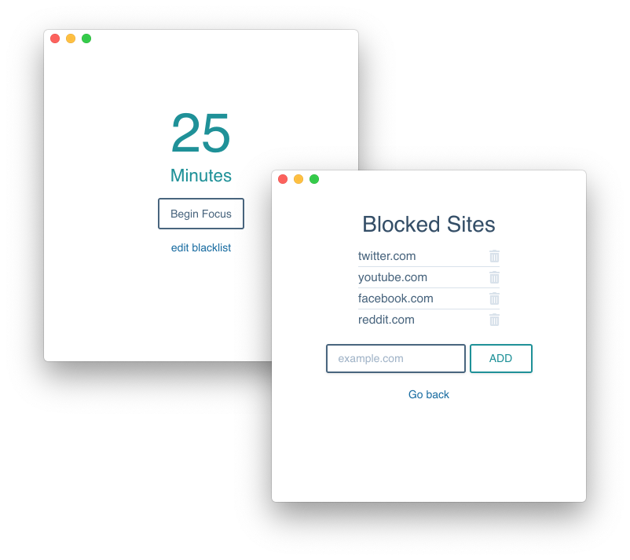

# Focus Up

An application that helps you stay focused on your work by blocking websites on your computer for a duration of time.

## Built With

- [Electron](https://electronjs.org/) - Used to build cross platform desktop apps
- [React](https://reactjs.org/) - Frontend framework used
- [Node.js](https://nodejs.org/en/) - Used to build scripts that block websites on your computer

## About

There are many apps out there based on the [Pomodoro Technique](https://en.wikipedia.org/wiki/Pomodoro_Technique) that allow you set a timer with the goal of maximizing your productivity during that time period.

Unfortunately, these apps do not provide **accountability**.

**Focus Up** will make sure you get you stay on task by blocking websites across your _entire computer_ while your timer counts down.

### Prerequisites

This app has been tested on **Mac OS Mojave** and **Windows 10**. While, it should run fine on other versions of these OS's, I have not been able to test them.

You must also have access to an **admin account** on your computer. Unfortunately this must be the case since we are blocking sites system wide.

### Installing

You can download the app [here](https://focusup.trevordebard.com) and follow installation instructions upon downloading. **Note: not compatable with Big Sur**

## Contributing

If you are interested in contributing to this project, please submit a pull request or reach out.
